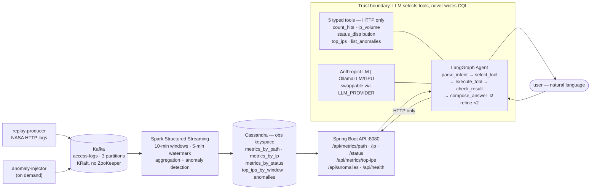

# Streaming Log Observability Platform

A full end-to-end streaming data pipeline and natural-language query agent,
built on Apache Kafka, Spark Structured Streaming, Apache Cassandra, Spring Boot,
and LangGraph. Real NASA HTTP access logs (1.9 M lines, July 1995) replay through
the pipeline at 200 req/s; a conversational agent answers questions about that
data in plain English, grounded strictly in what the system actually measured.

The architecture is designed for a distributed deployment — Kafka cluster,
Cassandra RF 3, Spark with multiple executors — but fully runnable on a single
Docker Compose host for development and demo. Moving to real nodes requires only
configuration changes; no application code changes.

---

## What makes this interesting

**A real distributed systems pipeline, not a toy.** Five independent services
communicate over Kafka and a REST API, each in the right language for its job:
Python for event replay and the ML-adjacent agent, PySpark for stateful stream
aggregation, Java/Spring Boot for the typed serving layer. The seams between them
are explicit contracts, not in-process calls.

**A principled safety boundary in the agent.** The LLM never writes a query. It
selects one of five typed Python functions; those functions make HTTP requests to
the API; the API makes single-partition Cassandra reads. An adversarial or
hallucinating model cannot reach the database directly — capability is constrained
by construction, not just by convention. This boundary was a design goal, not an
afterthought.

**Query-first Cassandra schema design.** Every table is shaped for exactly one
read pattern. `top_ips_by_window` uses `(window_start, request_count DESC,
client_ip)` as its primary key so `SELECT ... LIMIT N` returns the top N IPs
for a window with no sort step. The schema is the query plan.

**Non-trivial engineering problems encountered and solved.** Among others: Bitnami
removed all Docker Hub images mid-project, requiring migration to official Apache
images with different env-var conventions; Tomcat's path-traversal protection
rejected `%2F` in URL path segments, requiring a API contract redesign; passing
500-row JSON results to a 7B model caused context overflow and arithmetic
failures, solved by aggregating totals in Python before the LLM sees any data.

**Two LLM providers behind one interface.** `AnthropicLLM` and `OllamaLLM`
implement the same two-method interface. The same graph, tools, prompts, and test
suite run on both `claude-haiku-4-5` (cloud) and `qwen2.5:7b` (local GPU via
Ollama), validated end-to-end on both paths.

---

## Architecture



For a detailed discussion of every architectural decision, see
[docs/ARCHITECTURE.md](docs/ARCHITECTURE.md).

---

## Stack

| Layer | Technology | Version |
|---|---|---|
| Message bus | Apache Kafka (KRaft) | 3.7.1 |
| Stream processing | PySpark Structured Streaming | 3.5.3 |
| Storage | Apache Cassandra | 4.1.6 |
| API | Spring Boot · Java 17 · Maven | 3.3.6 |
| Agent framework | LangGraph · Python 3.11 | 0.2.59 |
| LLM (default) | Anthropic claude-haiku-4-5 | — |
| LLM (local/GPU) | Ollama · qwen2.5:7b | 0.6.2 |
| Deployment | Docker Compose | — |

---

## Quick start

**Prerequisites:** Docker Desktop for Windows (WSL2 backend), ≥8 GB RAM allocated,
≥4 CPUs. For the Anthropic agent path: an API key. For the Ollama/GPU path: an
NVIDIA GPU with the [NVIDIA Container Toolkit](https://docs.nvidia.com/datacenter/cloud-native/container-toolkit/install-guide.html).

```bash
git clone <repo-url> && cd streaming-observability-platform

# Configure
cp .env.example .env
# Set LLM_API_KEY=sk-ant-...  (Anthropic path)
# or LLM_PROVIDER=ollama, LLM_MODEL=qwen2.5:7b  (Ollama path)

# Download the NASA HTTP dataset (~20 MB compressed)
curl -L -o data/nasa_jul95.gz "https://github.com/greymd/NASA-HTTP/raw/main/NASA_access_log_Jul95.gz"
# Linux/WSL:
gunzip -k data/nasa_jul95.gz && mv data/nasa_jul95 data/access_log
# Windows without WSL: extract with 7-Zip, rename result to data/access_log

# Start the data plane
docker compose up -d

# Cassandra takes ~90 s to become healthy; confirm data is flowing after ~2 min:
docker compose exec cassandra cqlsh -e "USE obs; SELECT count(*) FROM metrics_by_path;"

# Start the API
docker compose --profile api up -d
curl -s localhost:8080/api/health   # → {"status":"UP"}
```

---

## Running the agent

### Anthropic (cloud)
```bash
docker compose --profile api --profile agent run --rm agent
```

### Ollama (local GPU, no API key)
```bash
docker compose --profile ollama up -d ollama
docker compose exec ollama ollama pull qwen2.5:7b
# In .env: LLM_PROVIDER=ollama, LLM_MODEL=qwen2.5:7b
docker compose --profile api --profile ollama --profile agent run --rm agent
```

---

## Try it

Ask the agent these questions — answers are grounded in the live Cassandra data
and cross-checkable with direct API calls:

```
how many hits to /shuttle/missions/ in July 1995
which IP made the most requests in the window starting 1995-07-03T16:20:00Z
show 4xx spikes on 2026-05-30
```

### Anomaly demo

```bash
# Inject a traffic spike (1500 req/window from one IP, 600 × 404s)
docker compose --profile tools run --rm anomaly-injector

# Demo tip: set WINDOW_MINUTES=1 WATERMARK_MINUTES=1 in .env and restart
# spark-streaming to see the anomaly surface in ~1 min instead of ~10.

# After one window, ask the agent:
# "show anomalies on <today's date>"
```

---

## Scaling to production

No application code changes are required. Only configuration:

- **Kafka:** add brokers, set `replication.factor=3`, `min.insync.replicas=2`
- **Cassandra:** `NetworkTopologyStrategy` RF 3, comma-separated `CASSANDRA_CONTACT_POINTS`
- **Spark:** `--master spark://host:7077 --num-executors N` instead of `local[*]`
- **Services:** move containers to their target hosts; only hostnames in env vars change

The distributed-by-architecture / single-host-by-deployment separation is
intentional: it keeps the architecture honest without requiring a real cluster
to build or demo it.
